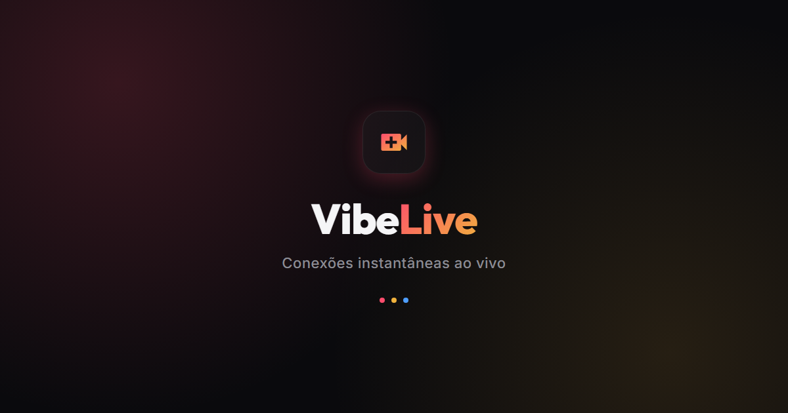

# VibeLive

Protótipo de app de vídeos ao vivo (estilo TikTok Live / Bigo), em HTML, CSS e JavaScript puros — sem build, sem dependências.

**Demo:** https://contactalexandresousa.github.io/vibelive/



## O que tem

- Descoberta de lives, stories, busca de perfis
- Sala de live com chat, presentes, roleta e batalha PK (1v1)
- Transmitir ao vivo (webcam simulada)
- Mensagens diretas
- Perfil com nível/XP, check-in diário e recarga de moedas via PIX (simulado)

## Rodar localmente

Não precisa de build. Basta servir os arquivos estáticos:

```bash
python -m http.server 8000
```

Depois abra `http://localhost:8000`. Em telas com menos de 500px de largura o app ocupa a tela cheia; em telas maiores aparece dentro de uma moldura de celular.

## Stack

`index.html` + `styles.css` + `app.js` — nenhuma dependência de build, framework ou backend. Todos os dados são mockados em `app.js` e vivem apenas na sessão do navegador.
